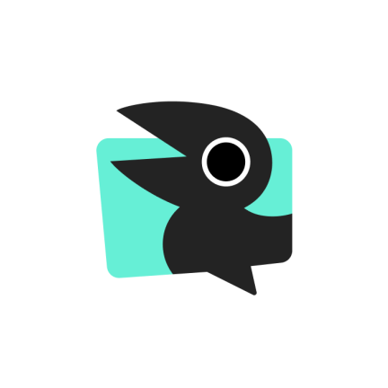
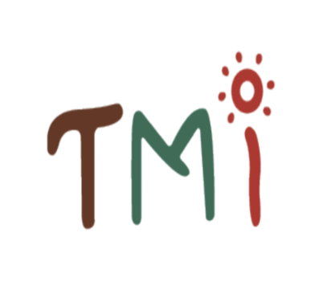
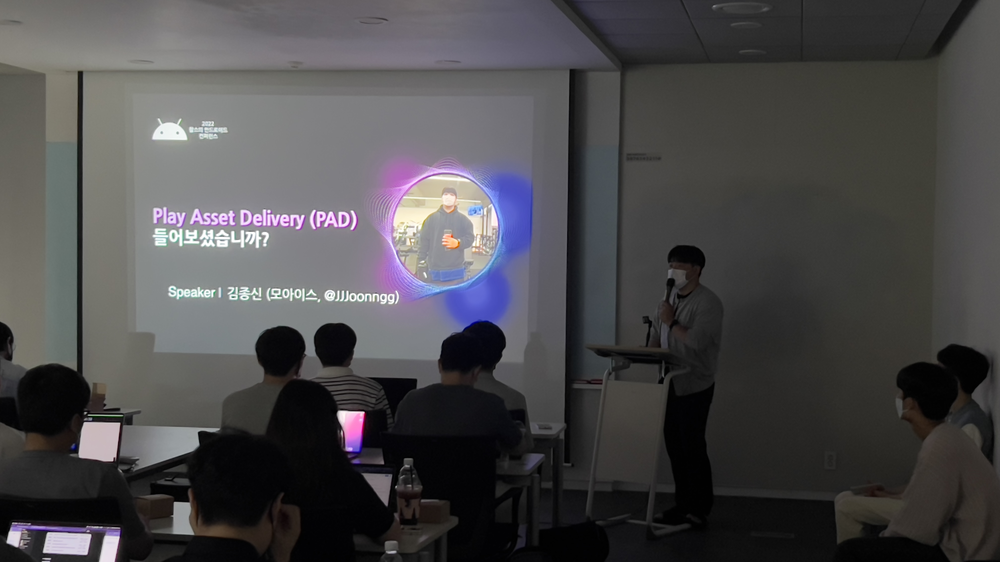

# **김종신** :bell: 

```
I am Kim Jong-shin, a developer of Android who pursues 'well' 
rather than 'hard' and tries to 'work hard' as well.
'열심히' 보단 '잘' 을 추구하며 또한 '열심히' 도 하려하는 안드로이드 개발자 김종신입니다.
```

### About Me

- **Android Developer** :computer:

- [GitHub](https://github.com/JJJoonngg)
- whdtls3878@gmail.com

---

### **경력** :man_factory_worker:

- [모아이스](https://www.moais.co.kr)
  - 안드로이드 개발 2020.07 ~

------

### 학력 :school::man_student:

- 한신대학교 / 컴퓨터공학과 (중퇴) [2013.03 ~ 2018.01]
- 인하대학교 / 컴퓨터 공학과 (졸업) [2018.03 ~ 2020.02]

------

### Android :sunny:

- Architecture : MVP, MVVM
- Language : Kotlin, Java

------

### **프로젝트 :film_projector:**


Golffix - AI 골프 스윙 분석 어플 ⛳️
- [PlayStore](https://play.google.com/store/apps/details?id=kr.co.moais.golffix&hl=ko&gl=US)
- 기간 : 2020.08 ~
- 역할 : 기능 개발, 유지 보수
<br>
<br>


Linco - 인스타툰과 이어주는 오작교! 🦅
- [Repository](https://github.com/Dongchin/linco)
- [PlayStore](https://play.google.com/store/apps/details?id=kr.co.dongchin.linco)
- 기간 : 2022.05 ~ 2022.12
- 역할 : 기능 개발, 유지 보수
<br>
<br>


TMI - today's moutain information :mountain:
- [Repository](https://github.com/Grace-Girls/TMI)
- 안전한 산행을 위해 산악인들에게 머신러닝을 기반으로한 산의 위험정도를 측정하여 알려주고 기타 기능들을 담은 어플리케이션
- 기간 : 2020.11 ~ 2020.12
- 역할 : 기능 개발, 프로젝트 관리
<br>
<br>
 

Beer. - 비어닷 :beers: - 세계맥주에 대한 정보를 담은 Application
- [Repository](https://github.com/landvibe-service/beereverything-android)
- [PlayStore](https://play.google.com/store/apps/details?id=com.landvibe.beereverything)
- 기간 : 2020.07~2020.10
- 역할 : 기능 개발
<br>
<br>

      

    

[BoostCourse - 안드로이드 프로그래밍](https://www.edwith.org/boostcourse-android) :movie_camera:
- 부스트 코스의 안드로이드 프로그래밍 프로젝트 A ~ H
- Repository (Private)
- 기간 : 2020.03 ~ 2020.04
-  [수료증](http://www.edwith.org/certificate/A20200503-702943?langCode=ko)   
    
<br>
<br>

        

Inha Mind : 인심 - 인하인의 마음을 전합니다 :heart:
- 채팅과 게시판을 Firebase로 구현한 앱
- [Repository](https://github.com/JJJoonngg/inhaMind)
- 기간 : 2020.01 ~ 2020.04
- 역할 : 기능 개발

---

### **대외 활동**🤹‍♀️


#### **DDD - 7기 참여**
- 기간 : 2022.04 ~ 2022.07
- 결과물 - [링크](https://dddset.notion.site/cfb25cab1a3d4ab8b06cc60a39878829)
- 팀 노션 - [링크](https://cottony-caraway-c5d.notion.site/DDD-Android-2-db4b3e78356c43b9ab37009a2785e239)
- 역할 : 프로젝트 기획, 기능개발, 유지보수 등
<br>
<br>


#### **[2022 찰스의 안드로이드 컨퍼런스](https://www.charlezz.com/?p=46069) - 발표**
- 날짜 : 2022.06.19
- Play Asset Delivery (PAD) 에 관한 발표 진행
- [발표자료](https://www.charlezz.com/wordpress/wp-content/uploads/2022/06/www.charlezz.com-2022-play-asset-delivery--play-asset-delivery-.pdf)
<br>
<br>


#### **DDD - 5기 참여**
- 기간 : 2021.02 ~ 2021.05
- 역할 : 기획, 안드로이드 피쳐 개발 등
- 직군세션 발표 관련 글 - [미디엄](https://dddstudy.medium.com/ddd-5%EA%B8%B0-%EC%A7%81%EA%B5%B0%EC%84%B8%EC%85%98-%EC%9D%B4%EC%95%BC%EA%B8%B0-c4f25748de22)

---

### **Contribution🎯**

#### Open CV

- Galaxy S21 and Android Version 12 - 프레임 추출시 터지는 문제
  - issue - https://github.com/opencv/opencv/issues/21149
  - PR - https://github.com/opencv/opencv/pull/21170

<br>

---
